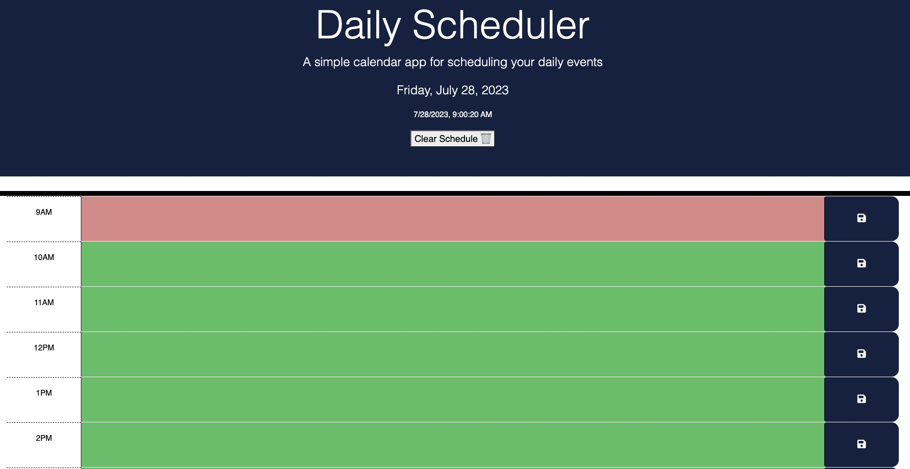
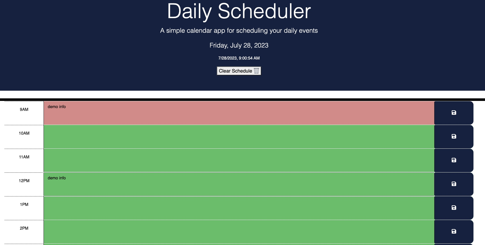
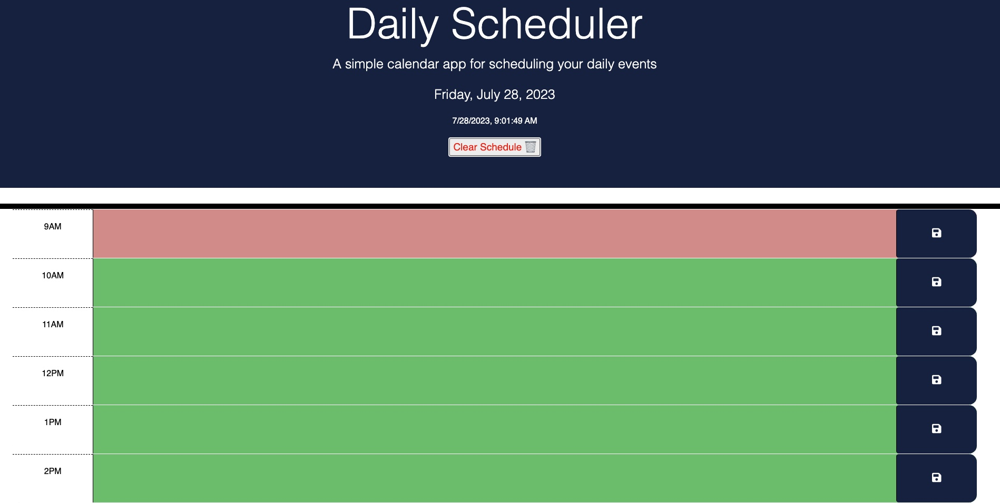

# Work Day Scheduler 

Add, store and delete events. 

## Desciption

This simple web application will allow you to track your daily events, store them when refreshed and delete them with the clear button.

## Live demo

https://nathankay89.github.io/week5pjt/

## Screenshots 
 
 
 
 

## Tests completed 

- Input tasks into different time blocks 
- refreshed page and the content stays 
- look at hour colour changes as the time changes throughout the day 
- Utilized the clear button to clear schedule 

## Credits 

original code forked from coding-boot-camp/crispy-octo-meme

## Licenses

https://choosealicense.com/non-software/

